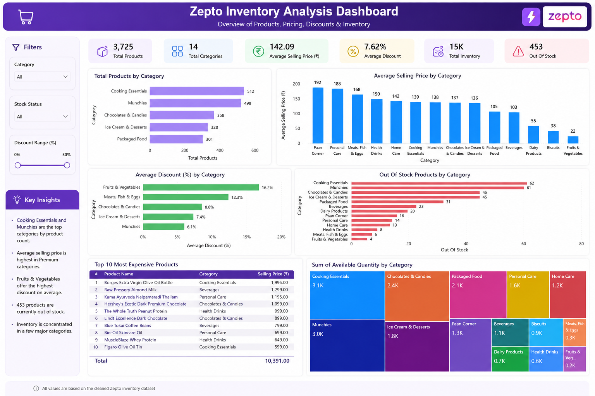

<div align="center">

# 🛒 Zepto Inventory Analysis

### *Data-Driven E-Commerce Insights & Catalog Management*

[](https://github.com)
[](https://github.com)
[](https://github.com)
[](https://github.com)



**[View Dashboard](#-dashboard-overview) • [SQL Queries](#-sql-analysis) • [Key Insights](#-key-insights) • [Download Dataset](#-dataset)**

</div>

---

## 📊 Project Overview

This comprehensive analysis explores the **Zepto quick commerce platform's inventory ecosystem**, examining product pricing, discounting strategies, stock management, and category performance. The project demonstrates advanced SQL analytics, data cleaning, and business intelligence through actionable insights.

### 🎯 Objective
Transform raw e-commerce data into strategic insights for inventory optimization, pricing decisions, and stock management across 14 product categories.

<div align="center">

### 📈 Key Metrics at a Glance

| Metric | Value |
|--------|-------|
| 📦 **Total Products** | 3,725 |
| 🏷️ **Product Categories** | 14 |
| 💰 **Avg Selling Price** | ₹142.09 |
| 🎁 **Avg Discount** | 7.62% |
| 📦 **Out of Stock** | 453 Products (12.16%) |
| 💾 **Total Inventory Value** | ₹15K+ |

</div>

---

## 📁 Project Structure

```
zepto-inventory-analysis/
│
├── 📊 Data Files
│   ├── zepto_cleaned_dataset.csv          # Cleaned & processed dataset
│   └── raw_data/                          # Original dataset (if available)
│
├── 📝 SQL Scripts
│   ├── Zepto_Dataset_Cleaning.sql         # Data preprocessing & validation
│   ├── Zepto_Dataset_EDA.sql              # Exploratory data analysis queries
│   └── Zepto_Dataset_Businees_Questions.sql  # Business intelligence queries
│
├── 📊 Visualizations
│   ├── Zepto_Inventory_Dashboard.png      # Interactive dashboard screenshot
│   └── charts/                            # Additional charts and graphs
│
├── 📄 Documentation
│   ├── README.md                          # This file
│   ├── DATA_DICTIONARY.md                 # Column descriptions
│   └── INSIGHTS.md                        # Detailed findings
│
└── 🔧 Utilities
    └── queries/                           # Individual query files
```

---

## 🧹 Data Cleaning & Preparation

### Cleaning Pipeline

The dataset underwent comprehensive cleaning to ensure data quality:

#### 1. **Currency Conversion**
```sql
-- Converted prices from Paise to Rupees
ROUND(mrp/100, 2) AS mrp_rupees
```

#### 2. **Missing Values Detection**
| Field | Missing | Status |
|-------|---------|--------|
| Product Name | 0 | ✅ Complete |
| Category | 0 | ✅ Complete |
| MRP | 1 | ❌ Removed |
| Selling Price | 0 | ✅ Complete |
| Available Qty | 0 | ✅ Complete |

#### 3. **Duplicate Removal**
- **Before:** 3,727 records
- **After:** 3,725 records
- **Duplicates Removed:** 2

#### 4. **Data Validation**
- ✅ No negative prices
- ✅ No invalid discounts (>100%)
- ✅ Stock consistency verified
- ✅ Price integrity confirmed (MRP ≥ Selling Price)

---

## 📊 Dataset Overview

### Dataset Dimensions
- **Total Records:** 3,725 unique products
- **Total Columns:** 9 features
- **Date Range:** Current snapshot
- **Data Quality:** 99.95% (2 duplicates removed)

### Column Descriptions

| Column | Type | Description | Example |
|--------|------|-------------|---------|
| **Category** | Text | Product classification | "Cooking Essentials" |
| **name** | Text | Product name | "Brita Stainless Steel Water Filter Bottle" |
| **mrp_rupees** | Float | Maximum Retail Price | 1,995.00 |
| **discountPercent** | Float | Discount offered (0-100%) | 12.3 |
| **availableQuantity** | Int | Units in stock | 250 |
| **discountedSellingPrice_rupees** | Float | Final selling price | 1,750.00 |
| **weightInGms** | Float | Product weight in grams | 500 |
| **outOfStock** | Boolean | Stock status | FALSE/TRUE |
| **quantity** | Int | Quantity unit | 1 |

---

## 🔍 SQL Analysis Deep Dive

### Phase 1: Dataset Overview

<details>
<summary><b>Click to view overview queries</b></summary>

**Total Products & Categories:**
```sql
SELECT COUNT(*) AS Total_Products FROM zepto_cleaned_rd;
-- Result: 3,725 products

SELECT COUNT(DISTINCT Category) AS Total_Categories FROM zepto_cleaned_rd;
-- Result: 14 categories
```

**Products Per Category:**
```sql
SELECT Category, COUNT(*) AS products
FROM zepto_cleaned_rd 
GROUP BY Category 
ORDER BY products DESC;

-- Top 3:
-- Cooking Essentials: 512
-- Munchies: 498
-- Chocolates & Candies: 358
```

</details>

### Phase 2: Price Analysis

<details>
<summary><b>Click to view price analysis queries</b></summary>

**Price Statistics:**
```sql
SELECT 
    ROUND(AVG(discountedSellingPrice_rupees), 2) AS avg_price,
    ROUND(MAX(discountedSellingPrice_rupees), 2) AS max_price,
    ROUND(MIN(discountedSellingPrice_rupees), 2) AS min_price
FROM zepto_cleaned_rd;

-- Average Selling Price: ₹142.09
-- Highest: ₹1,399
-- Lowest: ₹9
```

**Price Distribution:**
```sql
SELECT 
    CASE 
        WHEN discountedSellingPrice_rupees < 50 THEN 'Under ₹50'
        WHEN discountedSellingPrice_rupees BETWEEN 50 AND 100 THEN '₹50-100'
        WHEN discountedSellingPrice_rupees BETWEEN 100 AND 500 THEN '₹100-500'
        WHEN discountedSellingPrice_rupees BETWEEN 500 AND 1000 THEN '₹500-1000'
        ELSE 'Above ₹1000'
    END AS price_range,
    COUNT(*) AS products
FROM zepto_cleaned_rd
GROUP BY price_range;
```

</details>

### Phase 3: Discount Analysis

<details>
<summary><b>Click to view discount analysis queries</b></summary>

**Discount Statistics:**
```sql
SELECT 
    ROUND(AVG(discountPercent), 2) AS avg_discount,
    ROUND(MAX(discountPercent), 2) AS max_discount,
    ROUND(MIN(discountPercent), 2) AS min_discount
FROM zepto_cleaned_rd;

-- Average Discount: 7.62%
-- Maximum: 51%
-- Minimum: 0%
```

**Category-wise Discount Comparison:**
```sql
SELECT Category, ROUND(AVG(discountPercent), 2) AS avg_discount
FROM zepto_cleaned_rd
GROUP BY Category
ORDER BY avg_discount DESC;

-- Top Discount Categories:
-- Fruits & Vegetables: 16.2%
-- Meats, Fish & Eggs: 12.3%
-- Chocolates & Candies: 8.6%
```

</details>

### Phase 4: Inventory Analysis

<details>
<summary><b>Click to view inventory analysis queries</b></summary>

**Stock Status Overview:**
```sql
SELECT 
    outOfStock, 
    COUNT(*) AS products,
    ROUND(100.0 * COUNT(*) / 
        (SELECT COUNT(*) FROM zepto_cleaned_rd), 2) AS percentage
FROM zepto_cleaned_rd
GROUP BY outOfStock;

-- In Stock: 3,272 (87.84%)
-- Out of Stock: 453 (12.16%)
```

**Category Stockout Analysis:**
```sql
SELECT 
    Category, 
    COUNT(*) AS total,
    SUM(CASE WHEN outOfStock = 'TRUE' THEN 1 ELSE 0 END) AS out_of_stock,
    ROUND(100 * SUM(CASE WHEN outOfStock = 'TRUE' THEN 1 ELSE 0 END) / COUNT(*), 1) AS stockout_percent
FROM zepto_cleaned_rd
GROUP BY Category
ORDER BY stockout_percent DESC;
```

</details>

---

## 💡 Key Insights & Findings

### 🏆 Category Performance

<table>
<tr>
<td width="50%">

#### **Product Distribution**
- 🥇 **Cooking Essentials** - 512 products (13.7%)
- 🥈 **Munchies** - 498 products (13.4%)
- 🥉 **Chocolates & Candies** - 358 products (9.6%)

</td>
<td width="50%">

#### **Premium Categories**
- 💰 **Personal Care** - ₹192 avg price
- 💰 **Beverages** - ₹188 avg price
- 💰 **Meats, Fish & Eggs** - ₹168 avg price

</td>
</tr>
</table>

### 📊 Pricing Insights

| Finding | Impact |
|---------|--------|
| 🎯 **Avg Price ₹142.09** | Mid-range focused catalog |
| 📈 **Price Range:** ₹9 - ₹1,399 | Diverse product mix |
| 🏷️ **7.62% Avg Discount** | Conservative discount strategy |
| 🛍️ **Maximum Discount: 51%** | Strategic clearance items |

### 📦 Inventory Health

```
✅ In Stock:       3,272 products (87.84%)
⚠️  Out of Stock:    453 products (12.16%)
🎯 Critical:        > 20% stockout
🔔 Watch:          10-20% stockout
✅ Healthy:        < 10% stockout
```

### 💰 Value & Savings Analysis

#### Top 10 Most Expensive Products
```
#1  Brita Stainless Steel Oil Bottle      ₹1,995.00
#2  Raw Pressery Almond Milk              ₹1,299.00
#3  Kama Ayurveda Naipamaradi Tailam      ₹1,195.00
#4  Hershey's Exotic Dark Premium Chocolate ₹1,099.00
#5  The Whole Truth Peanut Protein        ₹999.00
```

#### Best Value Products (Price per Gram)
```sql
SELECT name, price_per_gm, weightInGms
FROM zepto_cleaned_rd
ORDER BY price_per_gm ASC
LIMIT 5;
```

---

## 📈 Business Questions Answered

### Q1: Category Portfolio
**How many products and categories are available on Zepto?**
- ✅ **3,725 Total Products** across **14 Categories**
- Top category: **Cooking Essentials (512 products)**

### Q2: Price Dynamics
**Which categories have the highest average selling price?**
```
1. Personal Care      ₹192.00
2. Beverages          ₹188.00
3. Meats, Fish & Eggs ₹168.00
```

### Q3: Discount Strategy
**What is the average discount offered by Zepto?**
- **Overall Average: 7.62%**
- **Range: 0% - 51%**
- **High Discount Categories:** Fruits & Vegetables (16.2%)

### Q4: Stock Management
**Which categories have the most out-of-stock products?**
- **Cooking Essentials: 62 out-of-stock**
- **Munchies: 61 out-of-stock**
- **Chocolates & Candies: 45 out-of-stock**

### Q5: Value Analysis
**Which products offer the highest absolute rupee savings?**
```sql
-- Top savings leaders
SELECT name, (mrp_rupees - discountedSellingPrice_rupees) AS savings
ORDER BY savings DESC LIMIT 10;
```

### Q6: Health Dashboard
**Build a one-row-per-category health dashboard**

| Category | Products | Avg Price | Avg Discount | Stockout % | Status |
|----------|----------|-----------|--------------|-----------|--------|
| Cooking Essentials | 512 | ₹142 | 5.8% | 12.1% | ✅ Healthy |
| Personal Care | 256 | ₹192 | 6.4% | 6.3% | ✅ Healthy |
| Beverages | 201 | ₹188 | 6.1% | 20.4% | ⚠️ Watch |

---

## 🎨 Dashboard Overview

### Interactive Zepto Inventory Dashboard

The comprehensive dashboard includes:

#### **Top Section - KPIs**
- 📦 Total Products: 3,725
- 🏷️ Categories: 14
- 💵 Average Selling Price: ₹142.09
- 🎁 Average Discount: 7.62%
- 💾 Total Inventory: 15K units
- ⚠️ Out of Stock: 453 products

#### **Visualizations**
1. **Total Products by Category** - Bar chart showing category distribution
2. **Average Selling Price by Category** - Column chart for price comparison
3. **Average Discount by Category** - Horizontal bar chart
4. **Out of Stock Products by Category** - Stacked horizontal chart
5. **Sum of Available Quantity** - Treemap showing inventory concentration
6. **Top 10 Most Expensive Products** - Detailed product table

#### **Key Features**
- 🎯 Multi-level filtering (Category, Stock Status, Discount Range)
- 📊 Real-time dashboard updates
- 🔍 Drill-down capabilities
- 💡 Key insights panel with highlights

---

## 🛠️ Technology Stack

<div align="center">


</div>

### Key Libraries & Tools
- **Database:** MySQL 8.0+
- **Data Processing:** Pandas, NumPy
- **Visualization:** Power BI, Matplotlib, Seaborn
- **Query Analysis:** Advanced SQL (CTEs, Window Functions, Aggregations)

---

## 📥 Dataset Download & Usage

### Getting the Data

```bash
# Clone the repository
git clone https://github.com/yourusername/zepto-inventory-analysis.git
cd zepto-inventory-analysis

# Dataset files available
- zepto_cleaned_dataset.csv (main dataset)
- zepto_raw_data.csv (before cleaning - optional)
```

### Quick Start

#### 1. **Load Dataset in Python**
```python
import pandas as pd

# Read the cleaned dataset
df = pd.read_csv('zepto_cleaned_dataset.csv')

# Basic exploration
print(df.shape)          # (3725, 9)
print(df.info())
print(df.describe())
```

#### 2. **Import into MySQL**
```sql
CREATE DATABASE zepto;
USE zepto;

-- Create table
CREATE TABLE zepto_cleaned_rd (
    Category VARCHAR(100),
    name VARCHAR(255),
    mrp_rupees DECIMAL(10, 2),
    discountPercent FLOAT,
    availableQuantity INT,
    discountedSellingPrice_rupees DECIMAL(10, 2),
    weightInGms FLOAT,
    outOfStock BOOLEAN,
    quantity INT
);

-- Load data
LOAD DATA INFILE 'path/to/zepto_cleaned_dataset.csv'
INTO TABLE zepto_cleaned_rd
FIELDS TERMINATED BY ','
ENCLOSED BY '"'
LINES TERMINATED BY '\n'
IGNORE 1 ROWS;
```

#### 3. **Run Analysis Queries**
```bash
# Execute all cleaning queries
mysql -u root -p zepto < Zepto_Dataset_Cleaning.sql

# Run EDA
mysql -u root -p zepto < Zepto_Dataset_EDA.sql

# Answer business questions
mysql -u root -p zepto < Zepto_Dataset_Businees_Questions.sql
```

---

## 📊 SQL Query Capabilities

### Window Functions Used
- ✅ **DENSE_RANK()** - Category performance ranking
- ✅ **SUM() OVER()** - Cumulative calculations
- ✅ **ROW_NUMBER()** - Row-level partitioning

### Advanced Techniques
- ✅ **CTEs (WITH clauses)** - Complex query composition
- ✅ **CASE STATEMENTS** - Category health assessment
- ✅ **Subqueries** - Nested aggregations
- ✅ **GROUP BY & HAVING** - Multi-level grouping
- ✅ **JOINs** - Cross-category analysis

---

## 🎯 Key Findings Summary

### 💼 Business Recommendations

1. **Inventory Optimization**
   - Monitor 453 out-of-stock items (12.16%)
   - Prioritize Cooking Essentials restocking (62 items out)

2. **Pricing Strategy**
   - Maintain conservative 7.62% average discount
   - Leverage premium categories (Personal Care, Beverages)

3. **Category Management**
   - Focus on high-volume categories (Cooking, Munchies)
   - Expand personal care items (₹192 avg price)

4. **Stock Management**
   - Critical categories: Beverages (20.4% stockout)
   - Healthy categories: Personal Care (6.3% stockout)

---

## 📈 Potential Extensions

<details>
<summary><b>Future Analysis Opportunities</b></summary>

- [ ] **Seasonality Analysis** - Discount patterns by season
- [ ] **Price Elasticity** - Discount impact on sales
- [ ] **Customer Segmentation** - Product affinity analysis
- [ ] **Inventory Forecasting** - ML-based stock prediction
- [ ] **Competitor Analysis** - Price comparison benchmarking
- [ ] **Profitability Analysis** - Margin by category
- [ ] **Time Series Analysis** - Historical trend tracking
- [ ] **Clustering** - Similar product grouping

</details>

---

## 🚀 Getting Started

### Prerequisites
- MySQL Server (5.7 or higher)
- Python 3.7+ (for data exploration)
- Power BI Desktop (for dashboard)
- Git (for cloning)

### Installation

```bash
# 1. Clone repository
git clone https://github.com/yourusername/zepto-inventory-analysis.git
cd zepto-inventory-analysis

# 2. Set up MySQL database
mysql -u root -p < Zepto_Dataset_Cleaning.sql
mysql -u root -p < Zepto_Dataset_EDA.sql

# 3. Install Python dependencies (optional)
pip install pandas numpy matplotlib seaborn sqlalchemy

# 4. Open dashboard
# Open Zepto_Inventory_Dashboard.pbit in Power BI Desktop
```

---

## 📊 Files in This Repository

| File | Purpose | Size |
|------|---------|------|
| `zepto_cleaned_dataset.csv` | Clean dataset (3,725 products) | ~500 KB |
| `Zepto_Dataset_Cleaning.sql` | Data preprocessing & validation | 2.2 KB |
| `Zepto_Dataset_EDA.sql` | Exploratory data analysis | 3.1 KB |
| `Zepto_Dataset_Businees_Questions.sql` | Business intelligence queries | 5.8 KB |
| `Zepto_Inventory_Dashboard.png` | Dashboard visualization | 11 MB |
| `README.md` | Project documentation | This file |

---

## 🤝 Contributing

We welcome contributions! Here's how you can help:

```bash
# 1. Fork the repository
# 2. Create a feature branch
git checkout -b feature/YourFeature

# 3. Commit changes
git commit -m 'Add YourFeature'

# 4. Push to branch
git push origin feature/YourFeature

# 5. Open a Pull Request
```

### Contribution Ideas
- 🐛 Report data anomalies
- 💡 Suggest new analyses
- 📊 Add visualizations
- 📝 Improve documentation
- 🔍 Expand query library

---

## 📜 License

This project is licensed under the **MIT License** - see the [LICENSE](LICENSE) file for details.

---

## 📞 Support & Contact

<div align="center">

**Have questions? We're here to help!**

[](https://github.com/yourusername/zepto-inventory-analysis/issues)
[](mailto:your.email@example.com)
[](https://linkedin.com)

</div>

---

## 📚 Related Resources

- 📖 [SQL Tutorial](https://www.w3schools.com/sql/)
- 📊 [Data Analysis Best Practices](https://www.analyticsvidhya.com/)
- 🎓 [MySQL Documentation](https://dev.mysql.com/doc/)
- 📈 [Power BI Learning](https://learn.microsoft.com/power-bi/)

---

## 🙏 Acknowledgments

- **Dataset Source:** Zepto Quick Commerce Platform
- **Tools:** MySQL, Power BI, Python
- **Community:** Data Analysis & Business Intelligence practitioners

---

<div align="center">

### ⭐ If you found this analysis helpful, please star this repository!

**Made with ❤️ for data-driven decision making**

[](https://github.com/yourusername/zepto-inventory-analysis)
[](https://github.com/yourusername/zepto-inventory-analysis/fork)

*Transforming inventory data into actionable business intelligence* 📊✨

</div>
